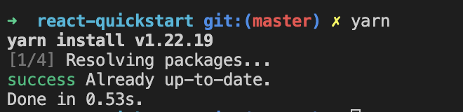
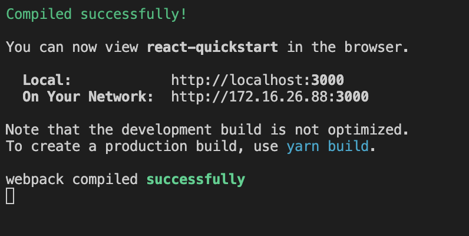
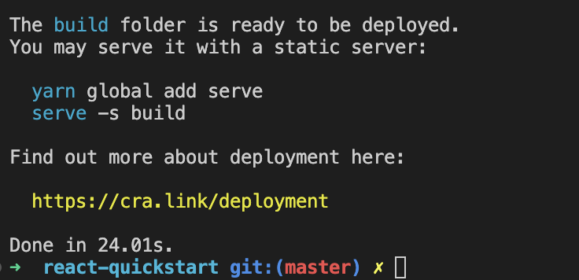
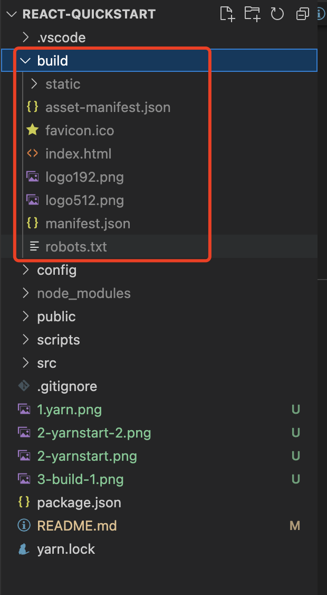

# Getting Started with Create React App

本项目来源于[《腾讯云 Cloud Studio 实战训练营》](https://marketing.csdn.net/p/06a21ca7f4a1843512fa8f8c40a16635)的参赛作品，该作品在腾讯云 [Cloud Studio](https://www.cloudstudio.net/?utm=csdn) 中运行无误。

1，项目安装依赖，执行下面命令
### ` yarn`
执行成功会看到下面的结果

2，项目启动,执行下面命令
### ` yarn start`
执行成功，控制台会看到如下结果

项目启动结果如下：

3，项目打包
执行如下命令进行打包
### `yarn  build`

会看到代码会多一个build文件夹，该文件夹下就是打包的内容

